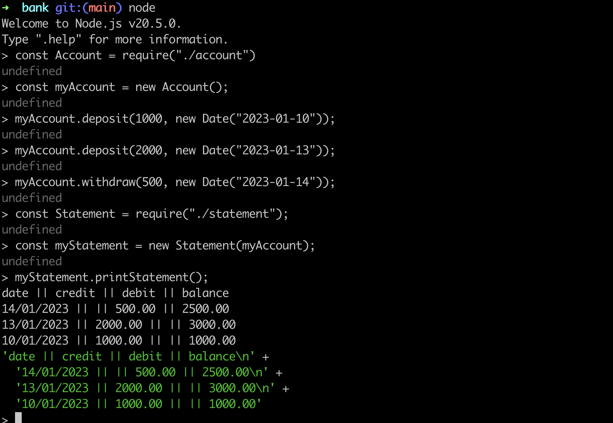
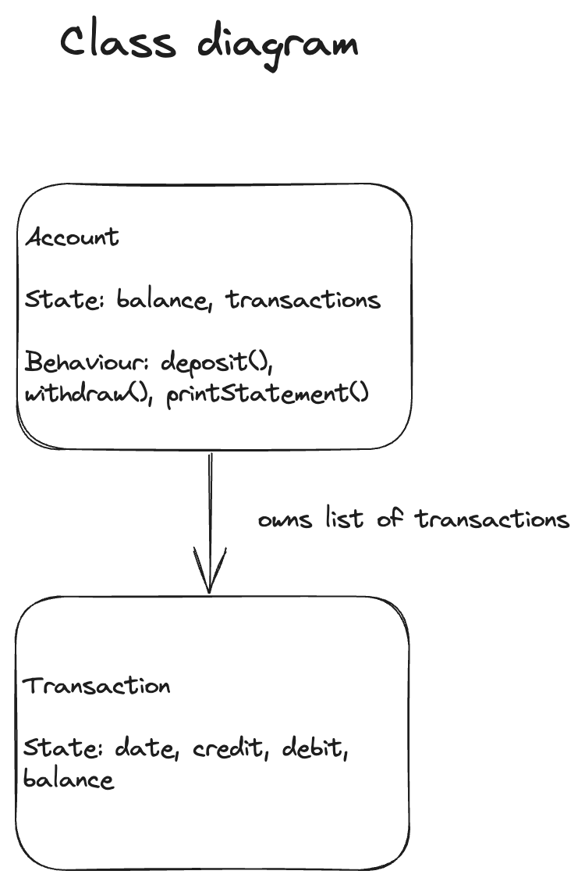

# Bank Tech Test

# How to use the program

## Prerequisites

Node.js and npm

## Installation

```diff
1. Clone this repository: `https://github.com/gmckz/bank_tech_test.git`

2. Navigate to the project folder: `cd bank_tech_test`

3. Install dependencies (this project has the jest testing library as a dependency): `npm install`
```

## Running the tests

The program has been unit and integration tested using the jest testing library.
To run the tests:

```diff
1. Navigate to the project folder: `cd bank_tech_test`
2. `npm run test`
```

## Using the program in the REPL

This program is designed to be used in the Node.js REPL from the terminal:

```javascript
// Start the Node.js REPL from the project folder
$ node

// Create an account
const Account = require("./account");
const myAccount = new Account();

// Make a deposit. The deposit function takes 2 arguments: amount (number), date (a javascript Date object)
myAccount.deposit(1000, new Date("2023-01-10"));
myAccount.deposit(2000, new Date("2023-01-13"));

// Make a withdrawal. The withdraw function takes 2 arguments: amount (number), date (a javascript Date object)
myAccount.withdraw(500, new Date("2023-01-14"));

// Print a statement of transactions
myAccount.printStatement();
```

Screenshot of REPL


# Specification

## Requirements

-   You should be able to interact with your code via a REPL
-   Deposits, withdrawal.
-   Account statement (date, amount, balance) printing
-   Data can be kept in memory (doesn't need to be stored to a database)

## Acceptance criteria

**Given** a client makes a deposit of 1000 on 10-01-2023  
**And** a deposit of 2000 on 13-01-2023  
**And** a withdrawal of 500 on 14-01-2023  
**When** she prints her bank statement  
**Then** she would see

```
date || credit || debit || balance
14/01/2023 || || 500.00 || 2500.00
13/01/2023 || 2000.00 || || 3000.00
10/01/2023 || 1000.00 || || 1000.00
```

# Planning / Design

I have used an object oriented approach to the design of this program. And strictly followed the TDD process while implementing it.

## User stories

As a user
so I can save money
I want to be able to deposit money into my account

As a user
so I can spend money
I want to be able to withdraw money from my account

As a user
so I can keep track of my transaction history
I want to be able to print a statement of my transactions

## Class design

-   nouns: account, transaction history, statement, transactions
-   verbs: deposit, withdraw, print

-   functions: deposit, withdraw, printStatement
-   classes: account, transaction



```javascript
class Account {
    // user-facing properties:
    //  balance: account balance, float
    //  transactions: a list of instances of Transaction

    constructor() {

    }

    deposit(amount, date) {
        // Parameters:
        //    amount: amount to deposit, float
        //    date: the transaction date, string
        // Side-effects:
        //    adds amount to balance
        //    creates instance of Transaction
        //    adds instance of Transaction to transactions array
    }

    withdraw(amount, date) {
        // Parameters:
        //    amount: amount to withdraw, float
        //    date: the transaction date, string
        // Side-effects:
        //    subtracts amount from balance
        //    creates instance of Transaction
        //    adds instance of Transaction to transactions array
    }

    printStatement() {
        // Returns:
        //    a multiline string of transactions
    }

class Transaction {
    // user-facing properties:
    //    date: the transaction date, a string
    //    credit: the amount credited to the account, a float if deposit or null if withdrawal
    //    debit: the amount debited from the account, a float if withdrawal or null if deposit
    //    balance: balance after transaction, a float

    constructor(date, credit, debit, balance) {

    }

}
```

# Example usage test cases

## Integration test case

```javascript
test("date, debit, credit and balance all display correctly in statement after a deposit is made", () => {});

test("date, debit, credit and balance all display correctly in statement after a withdrawal is made", () => {});

test("date, debit, credit and balance all display correctly in statement after a deposit is made and a withdrawal of less than the remaining balance is made", () => {});

test("date, debit, credit and balance all display correctly in statement after a deposit is made and a withdrawal of more than the remaining balance is made", () => {});

test("statement displays transactions correctly when a client makes a deposit of 1000 on 10-01-2023 and a deposit of 2000 on 13-01-2023 and a withdrawal of 500 on 14-01-2023", () => {});
```

## Unit test cases

### Transaction

```javascript
test(
	"creating an instance of Transaction with a date, credit, debit and balance sets the properties of the transaction to those values"
);
```

### Account

```javascript
test(
	"an instance of Account initially has a balance of 0 and transactions is an empty array"
);

test(
	"calling deposit(amount) adds the amount to the balance and adds a transaction instance to the transactions array"
);

test(
	"calling withdraw(amount) subtracts the amount from the balance and adds a transaction instance to the transactions array"
);

test(
	"calling deposit(0) does not change the balance or add to the transactions array"
);

test(
	"calling withdraw(0) does not change the balance or add to the transactions array"
);

test(
	"calling printStatement() before making any transactions prints just the header of the statement"
);
```
